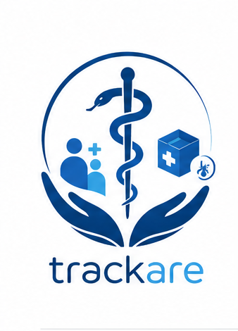
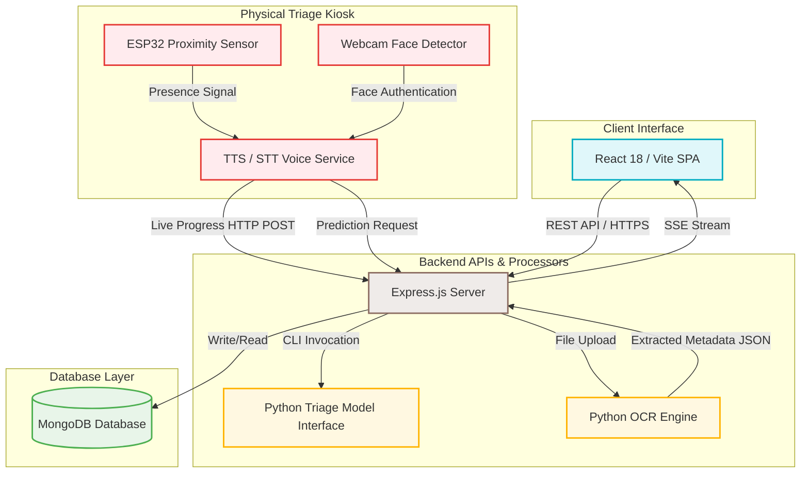

# 🏥 Trackare

[](#)
[](#)
[](#)
[](#)
[](#)
[](#)
[](#)

<p align="center">
  
</p>

<p align="center">
  <strong>An AI-powered smart healthcare platform for automated, contactless patient triage and intelligent pharmacy management.</strong>
</p>

---

## 📋 Table of Contents

- [Project Overview](#-project-overview)
- [Problem Statement](#-problem-statement)
- [Objectives](#-objectives)
- [Key Features](#-key-features)
- [System Workflow](#-system-workflow)
- [System Architecture](#-system-architecture)
- [Technology Stack](#-technology-stack)
- [Project Structure](#-project-structure)
- [Installation Guide](#-installation-guide)
- [Configuration](#-configuration)
- [Running the Project](#-running-the-project)
- [API Overview](#-api-overview)
- [AI Components](#-ai-components)
- [Future Improvements](#-future-improvements)
- [Team Members](#-team-members)

---

## 🔍 Project Overview

**Trackare** is an AI-driven, smart healthcare system designed to digitize and automate critical clinical workflows in resource-constrained medical facilities. Originally designed for rural community clinics in South Africa, Trackare addresses operational bottlenecks by combining IoT-based patient presence detection, contactless speech-to-text (STT) and text-to-speech (TTS) voice screening, deep-learning based optical character recognition (OCR), and machine learning triage classifiers.

The platform provides a dual-solution:
1. **Automated Patient Triage (Detect Sickness)**: Pre-screens patients via voice or touch, predicts probable conditions, and assigns the correct isolation/treatment room.
2. **Pharmacy Monitor**: Speeds up inventory updates by parsing drug packaging images via OCR to extract medicine names, dosages, and expiration dates.

---

## ❗ Problem Statement

Public healthcare clinics in developing regions face chronic resource shortages. This manifests in several critical areas:
* **Manual Triage Bottlenecks**: A single nurse must manually screen and take symptom histories for hundreds of patients daily, causing long queues and delaying urgent care.
* **Cross-Infection Vulnerabilities**: Waiting areas cluster patients with diverse symptoms (e.g., respiratory vs. gastrointestinal), allowing infectious diseases to propagate.
* **Bed & Ward Management**: Wards are monitored on paper sheets, making real-time occupancy updates and overflow detection impossible.
* **Inefficient Medicine Ingest**: Pharmacists enter expiration dates, brand details, and dosages manually, leading to human entry errors, overlooked expired stocks, and medication shortages.

---

## 🎯 Objectives

* **Automate Primary Screening**: Perform contactless triage using interactive voice response to lift the initial diagnostic burden from nursing staff.
* **Reduce Clinic Transmissions**: Avoid contact with surfaces and cross-exposure in waiting lines by using hands-free voice commands.
* **Enable Real-Time Clinic Visibility**: Log clinic occupancy instantly and reroute patients dynamically if assigned wards hit capacity.
* **Digitize Pharmacy Stocks**: Implement single-click image scans to parse packaging details, automating medication inventory creation.

---

## ✨ Key Features

* **🔐 Role-Based Access Control (RBAC)**: Secure access tailored to four specific roles (`Admin`, `Nurse`, `Triage`, `Pharmacy`) utilizing HTTP-only cookie-based JWT sessions.
* **🌲 Machine Learning Triage Engine**: A Random Forest classifier trained to parse 25 clinical symptoms and output diagnoses mapped to dedicated clinic rooms.
* **🎤 Triple Triage Modes**:
  * **Manual Web Form**: Quick checkbox checklist for medical staff.
  * **Browser Voice Mode**: Hands-free screen navigation using local French voice commands (`Oui` / `Non`).
  * **Physical AI Kiosk**: Proximity-activated kiosk linking webcam, voice synthesis, and real-time dashboard mirroring.
* **📡 Real-Time Dashboard Mirroring**: Implemented via Server-Sent Events (SSE), allowing administrators to see a live mirror of what a patient is answering at the kiosk.
* **💊 Intelligent Pharmacy OCR**: EasyOCR scanner that extracts crucial packaging details (Drug Name, Strength, Expiry Date) to bypass manual data entry.
* **🚨 Live Room Alert System**: Warns triage nurses and shifts patients to a hold state when assigned disease-isolation rooms exceed threshold limits.

---

## 🔄 System Workflow

```
[Patient Approaches] ➔ [ESP32 Sensor Detects / Webcam Confirms Face]
                                    │
                                    ▼
[Voice Questionnaire Starts] ➔ [Patient Answers "Oui"/"Non" via Mic]
                                    │
                                    ▼
[Live SSE Feed to Dashboard] ➔ [Random Forest Diagnostic Prediction]
                                    │
                                    ▼
                    [Ward Capacity Level Check]
                     /                       \
        [Capacity Available]            [Room Full Alert]
                 │                              │
                 ▼                              ▼
    [Route to Isolation Room]       [Assign Yellow "Wait" Status]
```

### 1. The Triage Flow
1. A patient approaches the physical triage booth. The **ESP32 presence sensor** fires a signal to the local Flask server, prompting the **Webcam** to scan for a face.
2. The interactive kiosk greets the patient in French using **Text-to-Speech (TTS)** and begins asking the 25 clinical symptom questions.
3. The patient responds with *"Oui"* or *"Non"*. The **Speech-to-Text (STT)** model processes the voice response.
4. Concurrently, the kiosk backend issues updates to `POST /api/result/progress`. The web dashboard captures this via a active **Server-Sent Events (SSE)** connection, flashing the matching symptom live on the doctor's monitor.
5. Upon completion, the model predicts the probable illness. The backend queries ward limits. If space is available, it outputs the room assignment; otherwise, it warns the system of capacity overflow and parks the patient in a temporary queue.

### 2. The Pharmacy Scan Flow
1. A clinic pharmacist takes an image of a medicine container and uploads it via the **Pharmacy Monitor** UI.
2. The Node backend routes the image to the **OCR Processor (`pharmacy_scan.py`)**.
3. EasyOCR parses the text blocks, running regular expression utilities to segment the **Medication Name**, **Dosage Strength**, and **Expiration Date**.
4. The output is placed in a browser-cached *Pending Scans* staging grid. The pharmacist reviews the results, clicks checkmark (✅) to confirm, and hits **Accept All** to write the records directly to MongoDB.

---

## 🏛️ System Architecture

The following diagram illustrates how the frontend client, backend application servers, hardware kiosks, and database storage communicate:



---

## 🛠️ Technology Stack

| Component | Technology | Version | Rationale |
| :--- | :--- | :--- | :--- |
| **Frontend** | React | `v18.x` | Declarative components for rendering real-time dashboard grids. |
| **Build Tool** | Vite | `v6.x` | Ultra-fast developer bundle times and hot module reloading. |
| **Styling** | Tailwind CSS | `v3.x` | Utility-first CSS class compiler for constructing modern responsive dashboards. |
| **Backend API** | Node.js / Express | `v18.x` / `v4.x` | Event-driven, asynchronous requests handling (crucial for SSE streams). |
| **Database** | MongoDB | Latest Atlas | Scalable document schema structure optimized for logs, audit trails, and inventory files. |
| **ML Engine** | scikit-learn | `v1.x` | Provides the production Random Forest classifier for disease classification. |
| **OCR Utility** | EasyOCR | Latest | PyTorch-powered deep learning optical recognition capable of recognizing multi-font medical packages. |
| **Computer Vision** | OpenCV | `v4.10.x` | Accesses camera feeds, handles video processing, and utilizes face classifiers. |
| **Speech Synthesizer** | pyttsx3 | Latest | Offline TTS framework offering responsive voice generation without internet lag. |
| **STT Engine** | SpeechRecognition | Latest | Python voice gateway bridging local microphone streams to Google Speech API. |
| **Microcontroller** | ESP32 | N/A | Low cost, low energy microcontroller mapping external sensor triggers. |

---

## 📂 Project Structure

```
Trackare/
├── backend/
│   ├── config/               # Database connection configurations (db.js)
│   ├── constants/            # Shared constants and system configurations
│   ├── controllers/          # Business logic handling (auth, patients, rooms, inventory)
│   ├── mailer/               # Email configuration (Nodemailer, SMTP templates)
│   ├── middleware/           # Auth validation and route permission guards
│   ├── ml/                   # Machine learning models & Python assets
│   │   ├── triage_rf_model_v2.pkl # Trained Random Forest ML model pickle file
│   │   ├── triage_kiosk.py   # Physical kiosk logic (ESP32 control, OpenCV, TTS/STT)
│   │   ├── pharmacy_scan.py  # EasyOCR wrapper parsing medication packaging
│   │   └── predict.py        # CLI diagnostic classifier wrapper
│   ├── models/               # MongoDB Mongoose collection schemas
│   │   ├── User.js           # User profiles with access level roles
│   │   ├── Patient.js        # Medical history data logs
│   │   ├── DiseaseClass.js   # Room mappings and limit threshold configs
│   │   └── Medication.js     # Pharmacy medication stock database
│   ├── routes/               # API route definitions
│   ├── utils/                # General utility helper logic
│   └── server.js             # Entry point for backend Express server
├── frontend/
│   ├── public/               # Static assets folder
│   ├── src/                  # React frontend source files
│   │   ├── api/              # Axios interface instances
│   │   ├── assets/           # UI media files (Brand logos)
│   │   │   ├── logo1.png     # Trackare brand logo (Light/Base)
│   │   │   └── logo11.png    # Trackare secondary brand logo
│   │   ├── components/       # Global UI components (Sidebar, App Layout)
│   │   ├── constants/        # Client routing configs and dropdown mappings
│   │   ├── hooks/            # Custom React hooks (Authentication contexts)
│   │   ├── pages/            # Core views
│   │   │   └── admin/        # Admin, Nurse, and Pharmacy dashboard screens
│   │   ├── routes/           # Protected SPA routes definition
│   │   └── utils/            # Helper formats (dates, file helpers)
│   ├── index.html            # Main HTML entry container
│   ├── vite.config.js        # Vite config properties
│   └── tailwind.config.js    # Tailwind system theme spacing overrides
├── package.json              # Main project dependencies and script configuration
├── .env.example              # Sample template showing necessary system parameters
└── README.md                 # Project main documentation
```

---

## ⚙️ Installation Guide

### Prerequisites
Make sure your workstation contains:
* **Node.js** `v18.x` or higher
* **MongoDB** server local instance or a MongoDB Atlas Cloud account
* **Python** `3.10` or `3.11`
* **Git** command utility

---

### Step 1: Clone the Repository
```bash
git clone https://github.com/Eya-Kouki2/Medi_Smart.git
cd Medi_Smart
```

---

### Step 2: Backend & System Setup
Install the root workspace package dependencies (Express, Mongoose, JWT utilities, Cloudinary):
```bash
npm install
```

---

### Step 3: Frontend Client Setup
Move to the frontend folder and install the UI runtime dependencies:
```bash
cd frontend
npm install
cd ..
```

---

### Step 4: Python AI and Hardware Dependencies
Move to the machine learning subfolder and run `pip install` to load the libraries:
```bash
cd backend/ml
pip install opencv-contrib-python==4.10.0.84 pyttsx3 SpeechRecognition joblib requests flask scikit-learn PyAudio easyocr
```

> [!IMPORTANT]
> **Windows Installation Notes**
> 1. **PyAudio**: If the standard PyAudio installation fails, download the matching pre-compiled binary `.whl` file corresponding to your exact Python version from [Unofficial Windows Binaries](https://github.com/cgohlke/pyaudio-builds/releases) and install it:
>    ```bash
>    pip install PyAudio-0.2.13-cp310-cp310-win_amd64.whl
>    ```
> 2. **OpenCV Version Control**: You **must** install `opencv-contrib-python==4.10.0.84`. OpenCV `5.x` removes the `CascadeClassifier` feature used by our facial verification pipeline.

---

## 📝 Configuration

Create a custom configuration file named `.env` inside the `backend/` directory:

```env
# Network Server Parameters
PORT=5000
NODE_ENV=development

# Database Storage Options
# Note: Ensure you whitelist your network IP address inside your MongoDB Atlas console
MONGO_URI=mongodb+srv://<username>:<password>@cluster0.xxxxx.mongodb.net/medismart?retryWrites=true&w=majority

# Security Keys
JWT_SECRET=your_long_cryptographically_secure_random_string

# Application Routing Links
CLIENT_URL=http://localhost:5173

# Email Node Service (SMTP Nodemailer Setup)
# Set up a Google Account App Password for secure email relay
EMAIL_USER=your_gmail@gmail.com
EMAIL_PASS=your_gmail_app_password
EMAIL_NAME=Trackare

# Cloudinary Integration (User Profile Avatars)
CLOUDINARY_CLOUD_NAME=your_cloudinary_cloud_name
CLOUDINARY_API_KEY=your_cloudinary_api_key
CLOUDINARY_API_SECRET=your_cloudinary_api_secret

# Frontend Client Cloudinary Presets
VITE_CLOUDINARY_CLOUD_NAME=your_cloudinary_cloud_name
VITE_CLOUDINARY_UPLOAD_PRESET=your_unsigned_upload_preset
```

---

## 🚀 Running the Project

To boot up the complete system, launch the services using **3 independent terminal shell instances**:

### Terminal 1: Backend Server
Start Node Express API via nodemon watcher:
```bash
# Executed from root directory
npm run dev
```
*Expected Log output:* `Server is running on port 5000`

---

### Terminal 2: React Web Frontend
Build assets and boot local Vite hot dev server:
```bash
cd frontend
npm run dev
```
*Expected Access link:* Open your browser to **http://localhost:5173**

---

### Terminal 3: Hardware Kiosk Service (Optional)
Run the voice kiosk interface integration (requires connected webcam and microphone):
```bash
cd backend/ml
python triage_kiosk.py
```
*Expected Log output:* `En attente d'une détection de présence (ESP32) sur le port 5001...`

#### Simulating Hardware Signal (Without Physical ESP32)
If you do not have the microcontroller hardware attached, trigger a fake detection request via Terminal 4:
* **Windows (PowerShell)**:
  ```powershell
  Invoke-WebRequest -Uri http://localhost:5001/presence -Method POST -Body "1" -UseBasicParsing
  ```
* **Linux/macOS (bash)**:
  ```bash
  curl -X POST -d "1" http://localhost:5001/presence
  ```
*The Kiosk will immediately wake up, locate your face via OpenCV, and guide you through the symptom triage session using voice.*

---

## 🔌 API Overview

Below is the routing index mapping endpoints, operations, and authorization levels:

| Method | Endpoint | Allowed Roles | Description |
| :--- | :--- | :--- | :--- |
| `POST` | `/api/auth/signup` | Public | Registers clinic accounts. Required clinic signup code: `MSH-XXXXXX`. |
| `POST` | `/api/auth/login` | Public | Authenticates credentials and sets HTTP-only session cookies. |
| `POST` | `/api/auth/logout` | Public | Clears cookies and terminates token sessions. |
| `GET` | `/api/patients` | `Admin`, `Nurse` | Retreives clinical records for registered patients. |
| `POST` | `/api/patients` | `Admin`, `Nurse` | Creates a new patient record. |
| `GET` | `/api/disease-classes`| `Admin`, `Nurse`, `Triage` | Lists sickness classes and room assignment configurations. |
| `POST` | `/api/disease-classes`| `Admin` | Adds or adjusts room threshold occupancy levels. |
| `POST` | `/api/ml/predict` | `Admin`, `Nurse`, `Triage` | Processes symptom matrix to generate disease classification labels. |
| `POST` | `/api/result/progress` | `Triage Kiosk` | Submits single-question triage answers from kiosk to web client. |
| `POST` | `/api/result` | `Triage Kiosk` | Broadcasts final triage outcomes to dashboard. |
| `GET` | `/api/result/stream` | `Admin`, `Nurse` | SSE endpoint returning real-time triage inputs. |
| `POST` | `/api/pharmacy/scan` | `Admin`, `Pharmacy` | Captures drug image files for processing. |
| `GET` | `/api/pharmacy` | `Admin`, `Pharmacy` | Fetches parsed scan queue records. |
| `POST` | `/api/pharmacy/accept` | `Admin`, `Pharmacy` | Moves verified medicine records into MongoDB collection. |

---

## 🤖 AI Components

### 1. Triage Symptom Classifier
* **Core Model**: Random Forest (RF) Ensemble Classifier.
* **Input Vector**: Array of 25 binary flags `[0, 1]` indicating the absence or presence of primary clinical symptoms (e.g., Fever, Cough, Chest Pain, Fatigue, Dyspnea).
* **Storage Artifact**: Compiled Python Pickle File (`triage_rf_model_v2.pkl`).
* **Inference Pipeline**: Express fires a CLI subprocess (`python backend/ml/predict.py <feature_vector>`), which runs the prediction and returns classification labels and confidence values.

### 2. OCR Medicine Scanner
* **Core Model**: EasyOCR (Deep Learning framework based on PyTorch architecture).
* **Image Processing**: OpenCV filters raw images to boost text contrast.
* **Extraction Strategy**: Regular Expression (regex) patterns parse the resulting OCR text dump to filter out dosage measurements (e.g. `500mg`, `10ml`) and expiry patterns (`MM/YYYY` or `DD-MM-YYYY`).

---

## 🔮 Future Improvements

* **💬 Native Multi-Language Speech Engine**: Build local language datasets (Zulu, Xhosa, Sotho, Afrikaans) using local open-source models like Vosk.
* **📶 Decentralized Offline Mode**: Localize SQLite fallback syncs to survive public grid power cuts and web network drops.
* **🛡️ FHIR Standard Compatibility**: Format patient schema structures to meet international FHIR (Fast Healthcare Interoperability Resources) data models.
* **📈 Predictive Epidemic Dashboards**: Analyze triage outcome trends on geographic maps to alert local authorities of disease outbreak clusters.

---

## 👥 Team Members

* 🎓 **Eya Kouki** — Dev Stack
* 🎓 **Fatma Lajmi** — AI Stack
* 🎓 **Ghayatelmouna Ben Khlifa** — AI Stack
* 🎓 **Mohammed Yassine Kammoun** — IoT & AI Stack
* 🎓 **Hamza Touati** — IoT & AI Stack

*A Graduation Project submitted to the Department of Software Engineering/Computer Science.*
