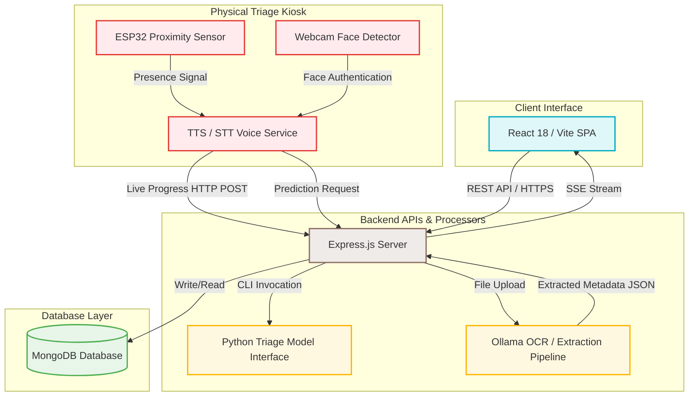

# 🏥 Trackare

[](#)
[](#)
[](#)
[](#)
[](#)
[](#)
[](#)

<p align="center">
  
</p>

<p align="center">
  <strong>An AI-powered smart healthcare platform for automated, contactless patient triage and intelligent pharmacy management.</strong>
</p>

---

## 📋 Table of Contents

- [Problem Statement](#-problem-statement)
- [Project Overview](#-project-overview)
- [Objectives](#-objectives)
- [Key Features](#-key-features)
- [System Workflow](#-system-workflow)
- [System Architecture](#-system-architecture)
- [Technology Stack](#-technology-stack)
- [Project Structure](#-project-structure)
- [Installation Guide](#-installation-guide)
- [Configuration](#-configuration)
- [Running the Project](#-running-the-project)
- [API Overview](#-api-overview)
- [AI Components](#-ai-components)
- [Team Members](#-team-members)

---

## ❗ Problem Statement

Public healthcare clinics in developing regions face chronic resource shortages. This manifests in several critical areas:
* **Manual Triage Bottlenecks**: A single nurse must manually screen and take symptom histories for hundreds of patients daily, causing long queues and delaying urgent care.
* **Cross-Infection Vulnerabilities**: Waiting areas cluster patients with diverse symptoms (e.g., respiratory vs. gastrointestinal), allowing infectious diseases to propagate.
* **Inefficient Medicine Ingest**: Manual inventory management leads to medicine and vaccine waste, stockouts, and reduced healthcare efficiency.

---

## 🔍 Project Overview

**Trackare** is an AI-driven, smart healthcare system designed to digitize and automate critical clinical workflows in resource-constrained medical facilities. Originally designed for community clinics in South Africa, Trackare addresses operational bottlenecks by combining IoT-based patient presence detection, contactless speech-to-text (STT) and text-to-speech (TTS) voice screening, deep-learning based optical character recognition (OCR), and machine learning triage classifiers.

The platform provides a dual-solution:
1. **Automated Patient Triage (Detect Sickness)**: Pre-screens patients via voice or touch, predicts probable conditions, and assigns the correct isolation/treatment room.
2. **Pharmacy Monitor**: Speeds up inventory updates by parsing drug packaging images via OCR to extract medicine names, dosages, and expiration dates.

---

## 🎯 Objectives

* **Automate Primary Screening**: Perform contactless triage using interactive voice response to lift the initial diagnostic burden from nursing staff.
* **Reduce Clinic Transmissions**: Avoid contact with surfaces and cross-exposure in waiting lines by using hands-free voice commands.
* **Enable Real-Time Clinic Visibility**: Log clinic occupancy instantly and reroute patients dynamically if assigned wards hit capacity.
* **Digitize Pharmacy Stocks**: Implement single-click image scans to parse packaging details, automating medication inventory creation.

---

## ✨ Key Features

* **🔐 Role-Based Access Control (RBAC)**: Secure access tailored to four specific roles (`Admin`, `Nurse`, `Triage`, `Pharmacy`) utilizing HTTP-only cookie-based JWT sessions.
* **🌲 Machine Learning Triage Engine**: A Random Forest classifier stored in `triage_rf_model_v2.pkl` and served through `predict.py` to map 25 symptoms to a disease label.
* **🎤 Triage Kiosk Service**: A Flask-based voice kiosk (`triage_kiosk.py`) that uses OpenCV, pyttsx3, and SpeechRecognition to guide the patient through the symptom flow.
  * **Manual Web Form**: Quick checkbox checklist for medical staff.
  * **Browser Voice Mode**: Hands-free screen navigation using local French voice commands (`Oui` / `Non`).
  * **Physical AI Kiosk**: Proximity-activated kiosk linking webcam, voice synthesis, and live dashboard mirroring.
* **📡 Real-Time Dashboard Mirroring**: Server-Sent Events stream kiosk progress and final results to connected dashboards.
* **💊 Pharmacy OCR Pipeline**: Upload a medicine image, run local Ollama OCR (`glm-ocr`) and extraction (`llava`) through `pharmacy_scan.py` and `pharmacy.py`, then stage the parsed result before saving.
* **🚨 Live Room Alert System**: Broadcasts kiosk updates and final predictions to connected dashboard clients.

---

## 🔄 System Workflow

```
[Patient Approaches] ➔ [ESP32 Sensor Detects / Webcam Confirms Face]
                                    │
                                    ▼
[Voice Questionnaire Starts] ➔ [Patient Answers "Oui"/"Non" via Mic]
                                    │
                                    ▼
[Live SSE Feed to Dashboard] ➔ [Random Forest Diagnostic Prediction]
                                    │
                                    ▼
                    [Ward Capacity Level Check]
                     /                       \
        [Capacity Available]            [Room Full Alert]
                 │                              │
                 ▼                              ▼
    [Route to Isolation Room]       [Assign Yellow "Wait" Status]
```

### 1. The Triage Flow
1. A patient approaches the physical triage booth. The **ESP32 presence sensor** fires a signal to the local Flask server, prompting the **Webcam** to scan for a face.
2. The interactive kiosk greets the patient in French using **Text-to-Speech (TTS)** and begins asking the 25 clinical symptom questions.
3. The patient responds with *"Oui"* or *"Non"*. The **Speech-to-Text (STT)** model processes the voice response.
4. Concurrently, the kiosk backend issues updates to `POST /api/result/progress`. The web dashboard captures this via a active **Server-Sent Events (SSE)** connection, flashing the matching symptom live on the doctor's monitor.
5. Upon completion, the model predicts the probable illness. The backend queries ward limits. If space is available, it outputs the room assignment; otherwise, it warns the system of capacity overflow and parks the patient in a temporary queue.

### 2. The Pharmacy Scan Flow
1. A clinic pharmacist takes an image of a medicine container and uploads it via the **Pharmacy Monitor** UI.
2. The Node backend stores the upload in `backend/ml/uploads/` and launches the local Python wrapper `pharmacy_scan.py` with the project venv interpreter.
3. `pharmacy_scan.py` calls `pharmacy.py`, which preprocesses the image, sends it to Ollama `glm-ocr` for OCR, then uses `llava` to extract `drug_name`, `strength`, and `expiry_date`.
4. The parsed result is returned to the browser as a pending scan item. The pharmacist reviews it, then clicks **Accept** or **Accept All** to write the verified records to MongoDB.

---

## 🏛️ System Architecture

The following diagram illustrates how the frontend client, backend application servers, hardware kiosks, and database storage communicate:



---

## 🛠️ Technology Stack

| Component | Technology | Version | Rationale |
| :--- | :--- | :--- | :--- |
| **Frontend** | React | `v18.x` | Declarative components for rendering real-time dashboard grids. |
| **Build Tool** | Vite | `v6.x` | Ultra-fast developer bundle times and hot module reloading. |
| **Styling** | Tailwind CSS | `v3.x` | Utility-first CSS class compiler for constructing modern responsive dashboards. |
| **Backend API** | Node.js / Express | `v18.x` / `v4.x` | Event-driven, asynchronous requests handling (crucial for SSE streams). |
| **Database** | MongoDB | Latest Atlas | Scalable document schema structure optimized for logs, audit trails, and inventory files. |
| **ML Engine** | scikit-learn + joblib | `v1.x` | Loads the trained Random Forest classifier used by `predict.py`. |
| **OCR / LLM** | Ollama + `glm-ocr` + `llava` | Local | Extracts medicine text and structured fields from package images in the pharmacy pipeline. |
| **Python Imaging** | Pillow + Requests | Latest | Preprocesses medicine images and sends OCR/extraction requests to Ollama. |
| **Computer Vision** | OpenCV | `v4.10.x` | Accesses camera feeds and handles face detection / image rotation processing. |
| **Speech Synthesizer** | pyttsx3 | Latest | Offline TTS framework offering responsive voice generation without internet lag. |
| **STT Engine** | SpeechRecognition | Latest | Python voice gateway bridging local microphone streams to the kiosk flow. |
| **Web Service** | Flask | Latest | Hosts the local presence endpoint used by the kiosk service on port `5001`. |
| **Microcontroller** | ESP32 | N/A | Low cost, low energy microcontroller mapping external sensor triggers. |

---

## 📂 Project Structure

```
Trackare/
├── backend/
│   ├── config/               # Database connection configurations (db.js)
│   ├── constants/            # Shared constants and system configurations
│   ├── controllers/          # Business logic handling (auth, patients, rooms, inventory)
│   ├── mailer/               # Email configuration (Nodemailer, SMTP templates)
│   ├── middleware/           # Auth validation and route permission guards
│   ├── ml/                   # Machine learning models & Python assets
│   │   ├── triage_rf_model_v2.pkl # Trained Random Forest ML model pickle file
│   │   ├── triage_kiosk.py   # Flask kiosk service, ESP32 presence handling, OpenCV, TTS/STT
│   │   ├── pharmacy.py       # Ollama-powered OCR and medicine data extraction pipeline
│   │   ├── pharmacy_scan.py  # CLI wrapper that runs pharmacy.py and prints JSON
│   │   ├── predict.py        # CLI diagnostic classifier wrapper
│   ├── models/               # MongoDB Mongoose collection schemas
│   │   ├── User.js           # User profiles with access level roles
│   │   ├── Patient.js        # Medical history data logs
│   │   ├── DiseaseClass.js   # Room mappings and limit threshold configs
│   │   └── Medication.js     # Pharmacy medication stock database
│   ├── routes/               # API route definitions
│   ├── utils/                # General utility helper logic
│   └── server.js             # Entry point for backend Express server
├── frontend/
│   ├── public/               # Static assets folder
│   ├── src/                  # React frontend source files
│   │   ├── api/              # Axios interface instances
│   │   ├── assets/           # UI media files (Brand logos)
│   │   │   ├── logo1.png     # Trackare brand logo (Light/Base)
│   │   │   └── logo11.png    # Trackare secondary brand logo
│   │   ├── components/       # Global UI components (Sidebar, App Layout)
│   │   ├── constants/        # Client routing configs and dropdown mappings
│   │   ├── hooks/            # Custom React hooks (Authentication contexts)
│   │   ├── pages/            # Core views
│   │   │   └── admin/        # Admin, Nurse, and Pharmacy dashboard screens
│   │   ├── routes/           # Protected SPA routes definition
│   │   └── utils/            # Helper formats (dates, file helpers)
│   ├── index.html            # Main HTML entry container
│   ├── vite.config.js        # Vite config properties
│   └── tailwind.config.js    # Tailwind system theme spacing overrides
├── package.json              # Main project dependencies and script configuration
├── .env.example              # Sample template showing necessary system parameters
└── README.md                 # Project main documentation
```

---

## ⚙️ Installation Guide

### Prerequisites
Make sure your workstation contains:
* **Node.js** `v18.x` or higher
* **MongoDB** server local instance or a MongoDB Atlas Cloud account
* **Python** `3.10` or `3.11`
* **Ollama** with the `glm-ocr` and `llava` models pulled for pharmacy scans
* **Git** command utility

To prepare the Ollama models after installing Ollama:
```bash
ollama pull glm-ocr
ollama pull llava
```

---

### Step 1: Clone the Repository
```bash
git clone <your-repo-url>
cd trackare
```

---

### Step 2: Backend & System Setup
Install the root workspace package dependencies (Express, Mongoose, JWT utilities, Cloudinary):
```bash
npm install
```

If you want to run the backend with PM2 cluster mode for load balancing, PM2 is already included as a project dependency. The `start:pm2` script will work after the install above.

---

### Step 3: Frontend Client Setup
Move to the frontend folder and install the UI runtime dependencies:
```bash
cd frontend
npm install
cd ..
```

---

### Step 4: Python AI and Hardware Dependencies
Create and use the project-local Python environment, then install the ML dependencies from `requirements.txt`:
```bash
py -m venv .venv
.venv\Scripts\activate
py -m pip install --upgrade pip
py -m pip install -r backend/ml/requirements.txt
```

> [!IMPORTANT]
> **Windows Installation Notes**
> 1. **PyAudio**: If the standard PyAudio installation fails, download the matching pre-compiled binary `.whl` file corresponding to your exact Python version from [Unofficial Windows Binaries](https://github.com/cgohlke/pyaudio-builds/releases) and install it:
>    ```bash
>    pip install PyAudio-0.2.13-cp310-cp310-win_amd64.whl
>    ```
> 2. **OpenCV Version Control**: You **must** install `opencv-contrib-python==4.10.0.84`. OpenCV `5.x` removes the `CascadeClassifier` feature used by our facial verification pipeline.
> 3. **Pharmacy OCR Runtime**: The pharmacy upload route calls `.venv\\Scripts\\python.exe` directly on Windows. If you use a different interpreter, set `PYTHON_BIN` in the backend environment.

---

## 📝 Configuration

Create a custom configuration file named `.env` inside the `backend/` directory:

```env
# Network Server Parameters
PORT=5000
NODE_ENV=development

# Database Storage Options
# Note: Ensure you whitelist your network IP address inside your MongoDB Atlas console
MONGO_URI=mongodb+srv://<username>:<password>@cluster0.xxxxx.mongodb.net/medismart?retryWrites=true&w=majority

# Security Keys
JWT_SECRET=your_long_cryptographically_secure_random_string

# Application Routing Links
CLIENT_URL=http://localhost:5173

# Email Node Service (SMTP Nodemailer Setup)
# Set up a Google Account App Password for secure email relay
EMAIL_USER=your_gmail@gmail.com
EMAIL_PASS=your_gmail_app_password
EMAIL_NAME=Trackare

# Cloudinary Integration (User Profile Avatars)
CLOUDINARY_CLOUD_NAME=your_cloudinary_cloud_name
CLOUDINARY_API_KEY=your_cloudinary_api_key
CLOUDINARY_API_SECRET=your_cloudinary_api_secret

# Frontend Client Cloudinary Presets
VITE_CLOUDINARY_CLOUD_NAME=your_cloudinary_cloud_name
VITE_CLOUDINARY_UPLOAD_PRESET=your_unsigned_upload_preset
```

---

## 🚀 Running the Project

To boot up the complete system, launch the services using **3 independent terminal shell instances**:

### Terminal 1: Backend Server
Start Node Express API via nodemon watcher:
```bash
# Executed from root directory
npm run dev
```
*Expected Log output:* `Server is running on port 5000`

If you want to use PM2 load balancing instead of nodemon:
```bash
npm run start:pm2
```

### Terminal 1b: Backend Server with PM2 Load Balancing
Use PM2 cluster mode when you want the backend to spread requests across CPU cores:
```bash
# Executed from root directory
npm run start:pm2
```
*Expected Behavior:* PM2 starts multiple Node workers in cluster mode and balances traffic across them.

To inspect or stop the process:
```bash
pm2 status
pm2 logs trackare-backend
pm2 stop trackare-backend
```

---

### Terminal 2: React Web Frontend
Build assets and boot local Vite hot dev server:
```bash
cd frontend
npm run dev
```
*Expected Access link:* Open your browser to **http://localhost:5173**

---

### Terminal 3: Hardware Kiosk Service (Optional)
Run the voice kiosk interface integration (requires connected webcam and microphone):
```bash
cd backend/ml
python triage_kiosk.py
```
*Expected Log output:* `En attente d'une détection de présence (ESP32) sur le port 5001...`

#### Simulating Hardware Signal (Without Physical ESP32)
If you do not have the microcontroller hardware attached, trigger a fake detection request via Terminal 4:
* **Windows (PowerShell)**:
  ```powershell
  Invoke-WebRequest -Uri http://localhost:5001/presence -Method POST -Body "1" -UseBasicParsing
  ```
* **Linux/macOS (bash)**:
  ```bash
  curl -X POST -d "1" http://localhost:5001/presence
  ```
*The Kiosk will immediately wake up, locate your face via OpenCV, and guide you through the symptom triage session using voice.*

---

## 🔌 API Overview

Below is the routing index mapping endpoints, callers, and behavior:

| Method | Endpoint | Caller | Description |
| :--- | :--- | :--- | :--- |
| `POST` | `/api/auth/signup` | Auth UI | Registers clinic accounts. Required clinic signup code: `MSH-XXXXXX`. |
| `POST` | `/api/auth/login` | Auth UI | Authenticates credentials and sets HTTP-only session cookies. |
| `POST` | `/api/auth/logout` | Session action | Clears cookies and terminates token sessions. |
| `GET` | `/api/patients` | Admin/Nurse UI | Retrieves clinical records for registered patients. |
| `POST` | `/api/patients` | Admin/Nurse UI | Creates a new patient record. |
| `GET` | `/api/disease-classes` | Admin/Nurse/Triage UI | Lists sickness classes and room assignment configurations. |
| `POST` | `/api/disease-classes` | Admin UI | Adds or adjusts room threshold occupancy levels. |
| `POST` | `/api/ml/predict` | Triage prediction form | Processes symptom matrix and returns the disease label. |
| `GET` | `/api/result/stream` | Dashboard EventSource client | SSE stream for live kiosk progress and final results. |
| `POST` | `/api/result/progress` | `triage_kiosk.py` | Broadcasts live question/answer updates to connected dashboards. |
| `POST` | `/api/result` | `triage_kiosk.py` | Broadcasts the final kiosk result to connected dashboards. |
| `POST` | `/api/pharmacy/scan` | Pharmacy Monitor UI | Uploads a medicine image and runs the OCR extraction pipeline. |
| `GET` | `/api/pharmacy` | Pharmacy Monitor UI | Fetches parsed scan queue records from MongoDB. |
| `POST` | `/api/pharmacy/accept` | Pharmacy Monitor UI | Moves verified medicine records into the MongoDB collection. |

---

## 🤖 AI Components

Trackare uses local Python services for triage prediction, pharmacy OCR, kiosk voice interaction, and camera-based presence handling:

### 1. Triage Symptom Classifier
* **Core Model**: Random Forest (RF) Ensemble Classifier.
* **Input Vector**: Array of 25 binary flags `[0, 1]` corresponding to clinical symptoms (e.g. fever, chills, cough, breathlessness).
* **Storage Artifact**: Serialized python pickle file (`triage_rf_model_v2.pkl`) loaded dynamically using `joblib`.
* **Execution**: Node.js executes the CLI wrapper (`predict.py`) and returns a JSON prediction payload.

### 2. Pharmacy OCR Pipeline (`pharmacy_scan.py` + `pharmacy.py`)
* **OCR Provider**: Ollama `glm-ocr` extracts visible text from the uploaded medicine image.
* **Structured Extraction**: Ollama `llava` converts the OCR text into JSON fields (`drug_name`, `strength`, `expiry_date`).
* **Image Preprocessing**: `pharmacy.py` uses Pillow to resize, sharpen, and increase contrast before sending the image to Ollama.
* **Runtime Output**: `pharmacy_scan.py` prints a single JSON object for the Node route, which then stages the scan in the pharmacy UI.

### 3. Voice Interaction Subsystem (`triage_kiosk.py`)
* **Speech Synthesis (Text-to-Speech)**: Uses the `pyttsx3` engine for offline text-to-speech voice generation. It runs in a separate process to avoid thread COM/run-loop deadlocks.
* **Speech Recognition (Speech-to-Text)**: Leverages `SpeechRecognition` combined with the Google Speech API to transcribe patient voice inputs. It decodes speech variables (such as *"Oui"* / *"Non"*) to control UI state.

### 4. Computer Vision Face Detection
* **Core Model**: Haar Cascade Classifiers.
* **Implementation**: Uses OpenCV (`cv2.CascadeClassifier`) with the pre-trained `haarcascade_frontalface_default.xml` file.
* **Verification**: Scans the webcam video feed upon ESP32 proximity triggers to confirm patient presence before booting up the voice triage session.

### 5. Kiosk Service Runtime
* **Framework**: Flask.
* **Role**: Hosts the local presence endpoint used by the kiosk service on port `5001`.

---

## 👥 Team Members

* 🎓 **Eya Kouki** — [LinkedIn](https://www.linkedin.com/in/kouki-eya-746b0b337/) | [koukieya43@gmail.com](mailto:koukieya43@gmail.com)
* 🎓 **Fatma Lajmi** — [LinkedIn](https://www.linkedin.com/in/fatma-lajmi/) | [Lajmifatma10@gmail.com](mailto:Lajmifatma10@gmail.com)
* 🎓 **Ghayatelmouna Ben Khlifa** — [LinkedIn](https://www.linkedin.com/in/ghayat-el-mouna-ben-khalifa-45609021a/) | [ghaya.benkhalifa@ieee.org](mailto:ghaya.benkhalifa@ieee.org)
* 🎓 **Mohammed Yassine Kammoun** — [LinkedIn](https://www.linkedin.com/in/mohamed-yassine-kammoun-446a592a7/) | [kammounmohammedyassine@gmail.com](mailto:kammounmohammedyassine@gmail.com)
* 🎓 **Hamza Touati** — [LinkedIn](https://www.linkedin.com/in/touati-hamza/) | [hamzatouati425@gmail.com](mailto:hamzatouati425@gmail.com)

*hot competition ies hubs and nodes*
